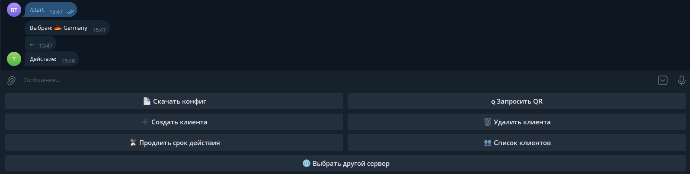
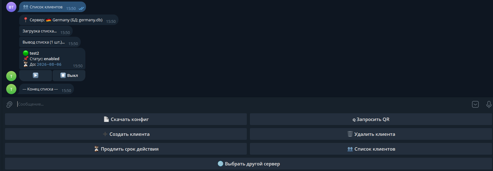
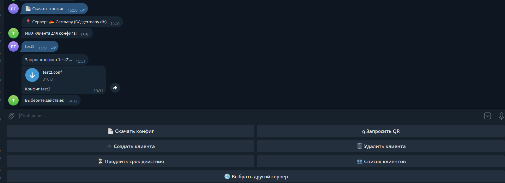

# Telegram Bot for wg-easy Management

A simple and convenient Telegram bot for managing clients on multiple **wg-easy** servers.

[English](#english) | [Русский (Russian)](#russian)

---

<a name="english"></a>

## English

A simple and convenient Telegram bot for managing clients on multiple **wg-easy** servers.

The bot allows an administrator to perform basic client operations directly from Telegram without accessing the web interface.

### 🖼️ Screenshots

| Server Selection | Main Menu | Client List |
| :---: | :---: | :---: |
|  |  |  |  |

### ✨ Features

-   **Multi-Server Support**: Switch between servers with a single command.
-   **Full Client Management**:
    -   ➕ Create new clients with a specified expiration term (1, 6, 12 months) or a specific date.
    -   🗑️ Delete clients from the server and the local database.
    -   👥 View a complete list of clients with their statuses (enabled/disabled on the server) and expiration dates.
    -   🟢/🔴 Enable and disable clients on the server.
-   **Configuration Retrieval**:
    -   📄 Download the `.conf` file.
    -   🇶 Get a QR code for quick setup on mobile devices.
-   **Expiration Management**:
    -   ⏳ Extend the subscription for an existing client.
    -   The bot stores expiration dates in a local SQLite database.
-   **Security**: Access to the bot is restricted to a list of allowed Telegram User IDs.

### 🚀 Installation and Setup

#### 1. Clone the Repository

```bash
git clone https://github.com/yamateh2014/tgbot-for-wireguard.git
cd tgbot-for-wireguard
```

#### 2. Create a Virtual Environment and Install Dependencies

It is recommended to use a virtual environment to isolate the project.

```bash
# Create a virtual environment
python3 -m venv venv

# Activate (Linux/macOS)
source venv/bin/activate

# Activate (Windows)
.\venv\Scripts\activate

# Install all required libraries
pip install -r requirements.txt
```

#### 3. Configure the Bot

All settings are stored in the `.env` file. Create it from the template:

```bash
# Linux/macOS
cp .env.example .env

# Windows
copy .env.example .env
```

Now, open the `.env` file in a text editor and fill it with your data:

-   `TELEGRAM_TOKEN`: Your bot's token. You can get it from [@BotFather](https://t.me/BotFather).
-   `SESSION_PASSWORD`: The password for the wg-easy web interface.
-   `ALLOWED_USERS`: Your Telegram User ID (and other administrators' IDs), separated by commas. You can find your ID by messaging [@userinfobot](https://t.me/userinfobot).
-   `DB_DIR`: The directory where the database files for each server will be stored (defaults to `db`).
-   `SERVERx_KEY`, `SERVERx_NAME`, `SERVERx_URL`: For each server, specify its system key, display name, and API URL.

#### 4. Run the Bot

After completing the setup, simply run the main script:

```bash
python3 bot.py
```

The bot will start and be ready to use. Send the `/start` command to it in Telegram.

---

### ⚠️ Important

-   For the QR code functionality (`cairosvg`) to work, you might need to install **additional system libraries**. On Debian/Ubuntu, you can do this with the following command:
    ```bash
    sudo apt-get update && sudo apt-get install -y libcairo2-dev
    ```


<a name="russian"></a>

## Русский (Russian)

Простой и удобный Telegram-бот для управления клиентами на нескольких серверах **wg-easy**.

Бот позволяет администратору выполнять основные операции с клиентами прямо из Telegram, не заходя в веб-панель.

### 🖼️ Скриншоты

| Выбор сервера | Главное меню | Список клиентов |
| :---: | :---: | :---: |
|  |  |  |  |


### ✨ Возможности

-   **Поддержка нескольких серверов**: переключайтесь между серверами одной командой.
-   **Полное управление клиентами**:
    -   ➕ Создание новых клиентов с заданным сроком действия (1, 6, 12 месяцев) или с указанием точной даты.
    -   🗑️ Удаление клиентов с сервера и из локальной базы данных.
    -   👥 Просмотр полного списка клиентов с их статусами (включен/выключен на сервере) и датами окончания срока.
    -   🟢/🔴 Включение и выключение клиентов на сервере.
-   **Получение конфигурации**:
    -   📄 Скачивание файла `.conf`.
    -   🇶 Получение QR-кода для быстрой настройки на мобильных устройствах.
-   **Управление сроком действия**:
    -   ⏳ Продление срока действия существующего клиента.
    -   Бот хранит сроки действия в локальной базе данных SQLite.
-   **Безопасность**: доступ к боту ограничен списком разрешенных Telegram User ID.

### 🚀 Установка и запуск

#### 1. Клонирование репозитория

```bash
git clone https://github.com/yamateh2014/tgbot-for-wireguard.git
cd tgbot-for-wireguard
```

#### 2. Создание виртуального окружения и установка зависимостей

Рекомендуется использовать виртуальное окружение для изоляции проекта.

```bash
# Создание виртуального окружения
python3 -m venv venv

# Активация (Linux/macOS)
source venv/bin/activate

# Активация (Windows)
.\venv\Scripts\activate

# Установка всех необходимых библиотек
pip install -r requirements.txt
```

#### 3. Настройка конфигурации

Все настройки хранятся в файле `.env`. Создайте его из шаблона:

```bash
# Linux/macOS
cp .env.example .env

# Windows
copy .env.example .env
```

Теперь откройте файл `.env` в текстовом редакторе и заполните его своими данными:

-   `TELEGRAM_TOKEN`: Токен вашего бота. Получить можно у [@BotFather](https://t.me/BotFather).
-   `SESSION_PASSWORD`: Пароль от веб-интерфейса wg-easy.
-   `ALLOWED_USERS`: Ваш Telegram User ID (и ID других администраторов) через запятую. Свой ID можно узнать у [@userinfobot](https://t.me/userinfobot).
-   `DB_DIR`: Папка, где будут храниться файлы баз данных для каждого сервера (по умолчанию `db`).
-   `SERVERx_KEY`, `SERVERx_NAME`, `SERVERx_URL`: Для каждого сервера укажите его системный ключ, отображаемое имя и URL-адрес API.

#### 4. Запуск бота

После завершения настройки просто запустите основной файл:

```bash
python3 bot.py
```

Бот будет запущен и готов к работе. Отправьте ему команду `/start` в Telegram.


### ⚠️ Важно

-   Для работы функций, связанных с QR-кодами (`cairosvg`), может потребоваться установка **дополнительных системных библиотек**. В Debian/Ubuntu это можно сделать следующей командой:
    ```bash
    sudo apt-get update && sudo apt-get install -y libcairo2-dev
    ```